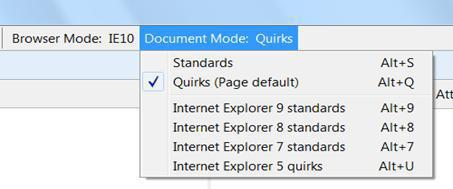

## 标准模式（Standards Mode）和怪异模式（Quirks Mode）[转]

### 定义

标准模式（Standards Mode）就是遵循 W3C 标准的页面渲染模式。

怪异模式（Quirks Mode）模式就是浏览器为了兼容很早之前针对旧版本浏览器设计、并未严格遵循 W3C 标准的网页而产生的一种页面渲染模式。

### 历史

IE 是最早提出 Quirks Mode 与 Standards Mode 的，后来 Firefox、Chrome、Safari、Opera 等浏览器也都支持了这两种渲染方式。但是只有在 IE 中用户才可以自由地在两种方式之间切换，其他浏览器都是自动匹配其中一种。下文将主要以 IE 为例来说明 Quirks Mode 对页面绘制的影响，下表展示了 IE 随着其渲染引擎的发展，它对 HTML 页面的渲染改变如下：

|Trident 版本|MSHTML.dll 版本|IE 版本|更新|
|---|---|---|---|
|unversioned|4.0.x	|4|首发|
|unversioned|5.0.x|5|增加对 CSS1 的支持及改变对 CSS 的渲染|
|unversioned|5.5.x	|5.5|修正部分 CSS 的排版控制|
|unversioned|6.0.x|6|修正 box model 的错误及新增 quirks Mode 的切换功能|
|unversioned|7.0.x|7|修正部分 CSS 排版错误以及增加对 PNGalpha 通道(半透明)|
|4.0|8.0.x	|8|第一个通过 Acid2 测试的版本|
|5.0|9.0.x|9|首次支持 HTML5、SVG、CSS3 及采用新的 JavaScript 引擎|
|6.0|10.0.x|10|支持 CSS3 多栏式排版、格子对齐、浮动式区块排版、渐变|

从上表可以清晰的看出，随着 IE 的发展，其渲染引擎（早期为 MSHTML.dll，后来命名为 Trident）也在不断加入新的特性以及修正一些早先版本的错误。在 2001 年 IE6 正式发布之前，当时的市面主要就是 IE 和 Netscape 的 Navigator 两款浏览器，而 IE 拥有很大的用户群，所以大多数的页面都是针对 IE 而设计的，但是 IE 的渲染引擎却没有遵循 W3C 的规范，当时微软已经认识到 W3C 规范的重要性,所以当 IE 发展到 IE6 的时候，渲染引擎（MSHTML.dll）做出了一个重要的改变，将自己原先不符合 W3C 规范中的盒模型 box model 绘制方式改为与 W3C 标准一致，由于这个重大的改动，原先针对 IE 旧版本所设计的 HTML 页面都不能正确显示了，所以在 IE6 发布的时候附带了一个切换回 IE5 页面渲染方式的功能，这个功能中就首次提出了 Quirks Mode。

当用户需要显示旧版本的页面时切换到 Quirks Mode，这时浏览器的渲染引擎就切换到 IE5.5 所对应的版本(MSHTML.dll 5.5.x)，box model 还是按照之前的方式绘制，这样页面就可以正确显示。当用户需要显示一些新的、满足 W3C 规范的页面时，渲染引擎切换到一个与 Quirks Mode 对应的 Standards Mode（标准模式），在此模式下渲染引擎就是当前的最新版本，这样也就满足了更多的 W3C 规范。这两种 Mode 之间的差别就是因为工作在不同版本的渲染引擎环境下。

最后，Quirks Mode 和 Standards Mode 合起来就称为浏览器的文档模式 Document Mode。

### Quirks 和 Standards 之外的第三种模式

实际上，在上文提到的具有 Quirks 和 Standards 两种文档模式的浏览器中还存在第三种模式 Almost Standards Mode。这种模式和 Standards Mode 几乎一致，唯一的区别就在于某些情况下 Almost Standards Mode 会采用与 Quirks 相同的方式来绘制页面。比如当我们需要把图片分割后显示在一个表格单元中时，Almost Standards Mode 与 Quirks Mode 采用同样的绘制方式从而让图片显示不像在 Standards Mode 中那么的四分五裂。
但是这只是极少数的情况，在大部分情况下 Almost Standards 和 Standards 两种模式是一致的，所以我们一般不专门区分二者，后面我们会提到如何查看浏览器渲染引擎信息，在这个信息中同样对 Almost Standards Mode 和 Standards Mode 是不做区分的。

### Quirks Mode 有两种

如果我们将 IE 升级到最新的 IE10 就会发现 IE10 除了拥有 IE7/8/9/10 Standards Mode 四种 Standards Mode，同样还有拥有了两种 Quirks Mode：IE5 Quirks 和 IE10 Quirks。随着 IE10 发布而产生的这个新的怪异模式 IE10 Quirks 被认为是一种更好的支持了 HTML5 规范的 Quirks Mode。我们可以发现针对 HTML5 规范而设计的页面（如含有`<audio>`、`<video>`、`<canvas>`等标签）在 IE5 Quirks 下是不能正确显示的，但是在 IE10 Quirks 下完全可以正确显示。也就是说，IE10 Quirks 是为了在那些针对 HTML5 设计，但是又没有添加 doctype 的页面而存在的。

### 如何查看 Document Mode
IE 中，用户可以在 developer tools 中切换模式，如图所示，IE10 的六种文档模式都被显示在 Document Mode 菜单下，用户可以直接选择，下一章的 Demo 我们都采用 IE10(version: 10.0.9200.16576)作为测试浏览器。



除了从 developer tools 中查看，还有可以从 document 对象的属性 compatMode 中获知文档模式，这个属性只有两个值 BackCompat 和 CSS1Compat，前者对应的是 Quirks Mode 后者对应 Standards Mode。在 developer tools 中切换文档模式时，页面会自动刷新，compatMode 的值也会随之改变。

### 浏览器如何判断文档类型？

上一节中我们知道 IE 用户可以在 developer tools 中改变文档模式。那么，如果用户没有自己选择，浏览器在准备解析、绘制一个页面的时候，它是如何决定文档模式的呢？实际上浏览器在渲染页面之前会检查两个内容，一个是页面是否有 `Doctype` 信息，另外一个是页面是否有 `X-UA-Compatibl`e 信息。

###### `Doctype` 检测

对于一个 HTML 页面，`<!DOCTYPE >` 声明位于其中最前面的位置，处于`<html>` 标签之前，这个 `<!DOCTYPE >` 可以告知浏览器使用哪种 HTML 规范，针对每种规范浏览器同样也会选择对应的文档模式。平时最常见的三种 `Doctype` 信息对应的文档模式如下。
- `<!DOCTYPE html>`：表明该页面是遵守了 HTML5 规范的，浏览器会选择 Standards Mode，这种 `Doctype` 是最推荐的一种，我们平时设计页面都应该加上这一个 doctype。
- `<!DOCTYPE HTML PUBLIC "-//W3C//DTD HTML 4.01//EN" "http://www.w3.org/TR/html4/strict.dtd">`：浏览器同样会选择 Standards Mode，虽然和第一种 doctype 有一些区别，但是几乎可以认为是一样的。
- `<!DOCTYPE HTML PUBLIC "-//W3C//DTD HTML 4.01 Transitional//EN" "http://www.w3.org/TR/html4/loose.dtd">`：浏览器会选择 Almost Standards Mode，需要注意的是如果今后需要把这个页面改为 HTML5 规范，那么上文讨论的 `<table>` 中的分割图片问题可能会错乱。
- 当 `Doctype` 缺失的时候，浏览器会选择 Quirks Mode，这是非常不推荐的方式，我们应该尽量避免 Quirks Mode，这对一个 web 应用是非常不利的地方。

###### X-UA-Compatible 信息

除了上一节提到的 `Doctype` 检测，HTML 页面的开发者可以在页面的 `<head>` 标签中加入 `X-UA-Compatible` 信息来影响文档类型的判定，具体如下表所示：

|`X-UA-Compatible`|`Doctype`|Document Mode|
|---|---|---|
|`<meta http-equiv="X-UA-Compatible" content="IE=5" >`|无影响|IE5 quirks|
|`<meta http-equiv="X-UA-Compatible" content="IE=7/8/9/10" >`|无影响|IE7/8/9/10 Standards|
|`<meta http-equiv="X-UA-Compatible" content="IE=Edge" >`|无影响|IE 最新版本的 Standards|
|`<meta http-equiv="X-UA-Compatible" content="IE=EmulateIE7/8/9" >`|`<!DOCTYPE html>`|IE7/8/9 Standards|
|`<meta http-equiv="X-UA-Compatible" content="IE=EmulateIE7/8/9" >`|不存在|IE5 quirks|
|`<meta http-equiv="X-UA-Compatible" content="IE=EmulateIE10" >`|`<!DOCTYPE html>`|IE10 Standards|
|`<meta http-equiv="X-UA-Compatible" content="IE=EmulateIE10" >`|不存在|IE10 quirks|

一般情况下 `X-UA-Compatible` 是优先于 `Doctype` 的设定的，但是当 `X-UA-Compatible` 设定了如 `“EmulateIExx”` 的情况时，就会同样考虑到 `Doctype` 的影响。

另外，在 `<head>` 中加入 `X-UA-Compatible` 信息与在请求消息的 header 中加入是等同的，如下代码效果是等同的。

```
response.setHeader("X-UA-Compatible","IE=Edge");
<meta http-equiv="X-UA-Compatible" content="IE=Edge" >
```

到现在为止我们分析了 Quirks Mode 产生的历史、对浏览器的影响以及浏览器如何选择文档模式。下一章我们主要讨论两种不同的文档模式下渲染页面的差别。

> 个人补充一下推荐的写法：`<meta http-equiv="X-UA-Compatible" content="IE=edge,chrome=1" />` 
`IE=edge` 告诉IE使用最新的引擎渲染网页，`chrome=1` 则可以激活 Chrome Frame。

> 有些因素会自动触发兼容性文档视图，这个时候设置 `X-UA-Compatible` 就可以防止这个自动触发的行为。 默认行为大致有这些：存在于注册表中的兼容性视图列表，当 url 匹配时将自动切换到兼容性视图；在注册表中的对应字段指定了使用兼容性视图来显示所有网站；未指定 `Doctype`，则使用 Quirks 模式；曾经遇到过错误。 

> 一个有意思的事实是，设置了 `<meta http-equiv="X-UA-Compatible" content="IE=edge">` 之后，即使未声明 `Doctype`，在 IE8、IE9（未测试IE10+，不过行为应该类似）下面，页面也不会进入 Quirks 模式。

### 标准模式下的页面与怪异模式下的页面区别

###### 盒模型 

出于历史原因，早期的 IE 浏览器（IE 6 以前）将盒子的 `padding` 和 `border` 算到了盒子的尺寸中，这一模型被称为 IE 盒模型。该模型如图所示：


在 IE 盒模型中，

```
box width = content width + padding left + padding right + border left + border right
box height = content height + padding top + padding bottom + border top + border bottom
```

而在 W3C 标准的盒模型中，box 的大小就是 `content` 的大小，如图所示，


```
box width = content width
box height = content height
```

这一区别将导致页面绘制时所有的块级元素都出现很大的差别，所以两种不同的文档模式下的页面也区别很大。

###### 图片元素的垂直对齐方式

CSS 为了确定文字行的位置，定义如下概念描述，`base line`，`bottom line`，`top line`， `middle line`。其中，`base line` 指的是一行字横排时下沿的基础线，`base line` 并不是汉字的下端沿，而是英文字母 e 的下端沿，`bottom line`，指的是汉字，或者英文字母 p，g 的下端沿。如下图所示：


对于 `inline` 元素和 `table-cell` 元素，在 IE Standards Mode 下 `vertical-align` 属性默认取值为 `baseline`。而当 `inline` 元素的内容只有图片时，如 `table` 的单元格 `table-cell`。在 IE Quirks Mode 下，`table` 单元格中的图片的 `vertical align` 属性默认为 `bottom`。因此，在 IE Standards Mode 下，图片底部会有几像素的空间。

###### `<table>` 元素中的字体

CSS 中，描述 `font` 的属性有 `font-family`，`font-size`，`font-style`，`font-weight`，分别表示了 `font` 的族系、大小、风格以及粗细。
描述

在 CSS 标准中，上述属性都是可以继承的。而在 IE Quirks Mode 下，对于 `table` 元素，字体的某些属性将不会从 `body` 或其他封闭元素继承到 `table` 中，特别是 `font-size` 属性。

###### 内联元素的尺寸

CSS 中常见的元素有两类，分别是 `block`（块级）元素及 `inline`（内联）元素。这两类元素的主要区别在于 `block` 元素通常作为独立的一块继续显示，前后都有换行，而 `inline` 元素则不会产生换行。根据 CSS 标准，对于 `inline` 元素，又可以分为 `replaced` 和 `non-replaced` 两类。

`replaced` 元素就是浏览器根据元素的标签和属性，来决定元素的具体显示内容。 
例如浏览器会根据 `` 标签的 `src` 属性的值来读取图片信息并显示出来，而如果查看代码，则看不到图片的实际内容；又例如根据 `<input>` 标签的 `type` 属性来决定是显示输入框，还是单选按钮等。

而大多数元素是 `non-replaced` 元素，即其内容直接表现给用户。

在 IE Standards Mode 下，`non-replaced inline` 元素无法自定义大小，而在 IE Quirks Mode 下，定义这些元素的 `width` 和 `height` 属性，能够影响该元素显示的大小尺寸。

###### 元素的百分比高度

原文例子不对，待考证。

###### 元素溢出的处理

CSS 中 `overflow` 属性定义了一个元素的内容不适合指定的尺寸时，溢出元素内容的处理方式。默认值为 `visible`，即显示溢出。

在 IE Standard Mode 下，`overflow` 取默认值 `visible`，即溢出可见，这种情况下，溢出内容不会被裁剪，呈现在元素框外。而在 Quirks Mode 下，该溢出被当做扩展 `box` 来对待，即元素的大小由其内容决定，溢出不会被裁剪，元素框自动调整，包含溢出内容。